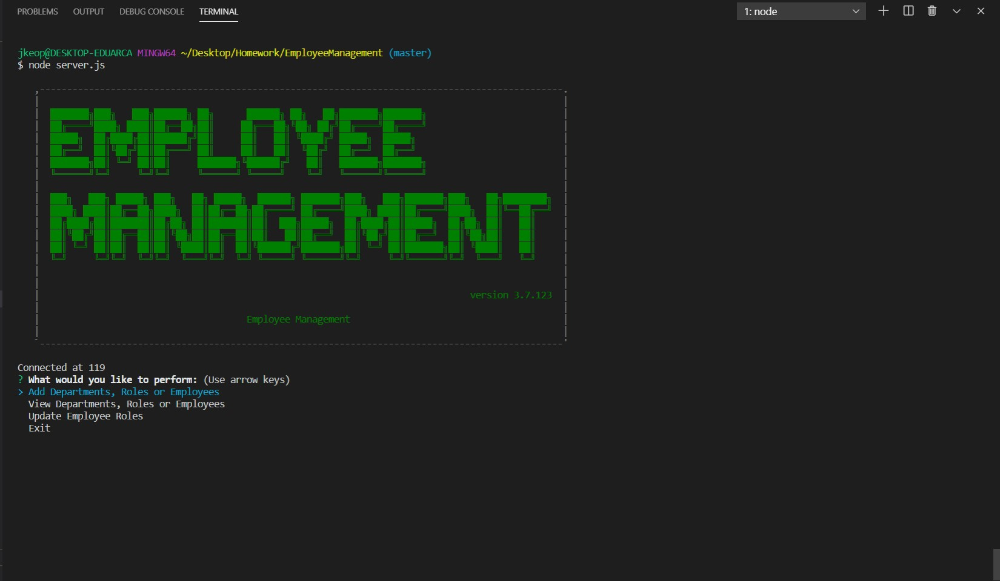

# README

---

## Description

Employee Management

## Goals

1. Build an application using a command-line interface that provides a company a solution to manage its' employees
2. Properly integrate node, inquirer and MySQL for database and command-line structure
3. As a manager, the user is able to add or view departments, roles, and employees or update roles
4. A screenshot and link are provided to preview the application

 
[Employee Management](https://drive.google.com/file/d/1HlKdk_SXaz-9ltyV0J4LdQ-ibYjN0cM0/view)

## Technology Used

- Node JS
- Inquirer
- Javascript
- MySQL
- Console Table
- Ascii-Art

## Table of Contents

[Installation](#installation) 
[Usage](#usage) 
[Contributions](#contributions) 
[Description](#description) 

## Installation

Run server.js in terminal

## Usage

Application for managing employee database

## Contributions

Jon Keopangna

## Testing

N/A

## License

 
For more information use the link provided.

## Contact For Questions

Github: [jkeopangna](https://github.com/jkeopangna/readMeGenerator) 
Email: [jkeopangna](https://gmail.com)
